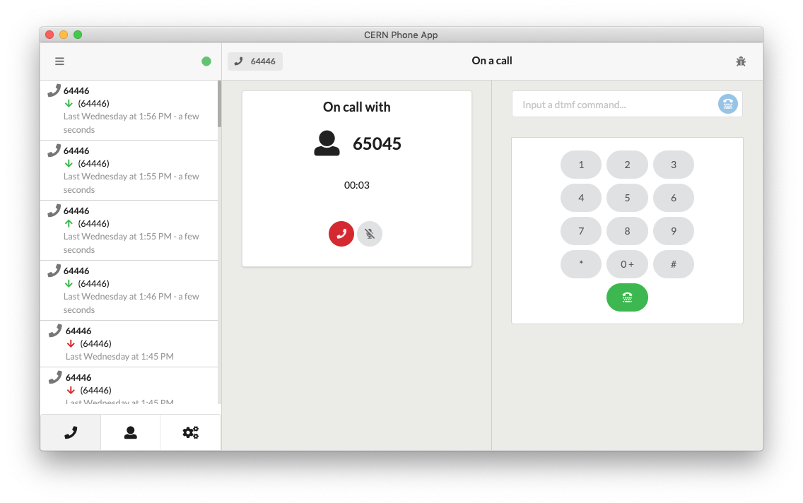

# Dial Webapp



Dial is a webapp built using React whose purpose is making and receive calls among other features.

## Status

[](https://travis-ci.org/cern-phone-apps/desktop-phone-app)
[](https://david-dm.org/cern-phone-apps/desktop-phone-app)
[](https://codeclimate.com/github/cern-phone-apps/desktop-phone-app/maintainability)
[](https://codeclimate.com/github/cern-phone-apps/desktop-phone-app/test_coverage)
[](https://codecov.io/gh/cern-phone-apps/desktop-phone-app)

## Packaging and Deployment

- [Packaging and Deployment Docs](docs/pack-and-deploy.md)

## Development

- [Requirements](#requirements)
- [Read the docs](#0-read-the-docs)
- [Install dependencies](#install-dependencies)
- [Creating the .env configuration files](#creating-the-env-configuration-files)
- [Setting up the mock server](#setting-up-the-mock-server)
    - [Mock Server methods](#mock-server-methods)
- [Adding your own API Client](#adding-your-own-api-client)
- [Run the application](#run-the-application)
- [Testing the application](#testing-the-application)
    - [Unit tests](#unit-tests)
    - [Integration tests](#integration-tests)

### Requirements

- node >= v11.10
- yarn >= 1.17.3
- Docker (to build the Linux version)

### 0. Read the docs

- [Contributing Guidelines](docs/CONTRIBUTING.md)
- [Git Basics](docs/git-basics.md)

### 1. Install dependencies

```bash
yarn install
```

## 2. Creating the config.js configuration file

This project gets the configuration from the `src/config.js` file.
There is a `config.sample.js` file that can be used as example.

This file includes several enviroments that must be set:

- prod
- next
- dev
- test

## Setting up the mock server

    ⚠️ TODO: Update the responses from the server

The mock server simulates the behaviour of a backend server by providing some sample responses.

Then run the server:

```bash
yarn run mock-server
```

More info about this server: https://github.com/smollweide/node-mock-server#readme

### Mock Server methods

* GET `/OAuth/Authorize`
* POST `/auth/v1/login/`
* DELETE `/auth/v1/logout/`
* GET `/api/v1/users/me/`
* GET `/api/v1/numbers/`
* GET `/api/v1/users/search/`
* GET `/api/v1/users/`

## Run the application

* `yarn electron-start`: Runs the application on development mode.

### Run the application in debug mode using Visual Studio Code

The project configuration is defined in the .vscode folder. In this folder we have configured the Visual Studio Code debugger with a launch.json file. To run it in debug mode just go to the "bug" icon in the Visual Studio code and click on the start server.

## Testing the application

Application can be tested in two different ways:

* Using [Jest](https://jestjs.io/) to run the tests.
* Using [React Testing Library](https://testing-library.com/docs/react-testing-library/intro) for the unit testing.

### Unit tests

Tests are located in each component folder.

In order to run them:

```bash
yarn test
```

#### Coverage testing

To test the modified files:

```bash
yarn test --coverage
```

To test all the files:

```bash
yarn test --coverage --watchAll
```

## Continuous Integration

- The code is tested on every push and PR
- Code coverage using [CodeCov](https://codecov.io/) is also triggered and if the coverage decreases, the CI will fail.

### Execute the generated AppImage

You will probably need to set the AppImage as executable.

To do so:
- Right click on the AppImage file
- Select "Properties"
- Click on the "Permissions" tab
- Check "Allow executing file as a program"
- Close this window

You can also do this from the command line:

```
sudo chmod +x path_to_AppImage
./path path_to_AppImage
```

## Other Docs

- [Create React App Docs (Local)](docs/react.md)
