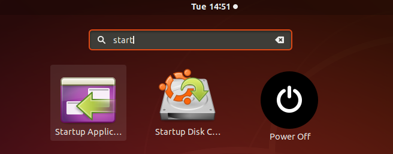
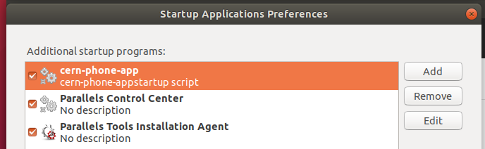
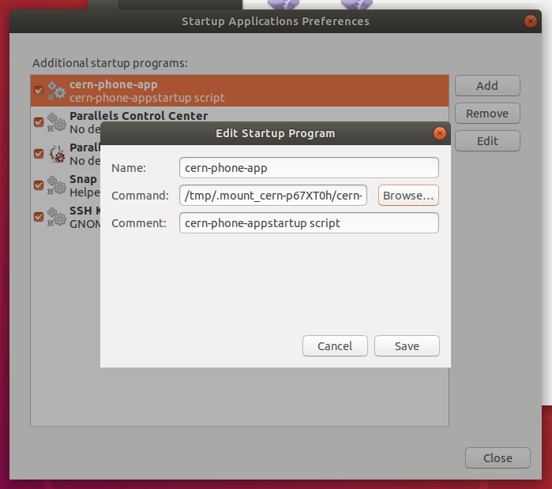
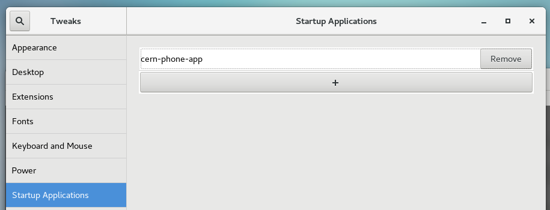

# Frequently Asked Questions

## How to fully clear the app data in Mac OS?

Remove the following folders

```bash
rm -rf /Applications/CERN\ Phone\ App.app;
rm -rf ~/Library/Caches/ch.cern.phonewebapp;
rm -rf ~/Library/Caches/ch.cern.phonewebapp.ShipIt;
rm -rf ~/Library/Logs/CERN Phone App;
rm -rf ~/Library/Preferences/ch.cern.phonewebapp.plist;
rm -rf ~/Library/Saved Application State/ch.cern.phonewebapp.savedState;
rm -rf ~/Library/Application\ Support/cern-phone-app;
```

⚠️ In some cases it is necesary to restart the computer afterwards.

## How to enable the app auto startup in Ubuntu 18.04?

> There is a known issue with AppImage applications and auto startup. These applications are copied and run from the `/tmp` folder and this folder is removed once the app is closed.

Once auto start is enabled in the app, users must do the following:

1. Open the "Startup Applications".

    

2. Locate the `cern-phone-app` and click the `Edit` button.

    

3. Change the `Command` and browse for the real location of the CERN Phone App.

    

4. Click on save.

## How to enable the app auto startup in Centos 7?

> Same issue as in the Ubuntu version, but in Centos it is not possible to edit the entries, therefore the process must be completely manual.

1. Search for "Tweak Tool".

    

2. Add the app manually to the list.

    